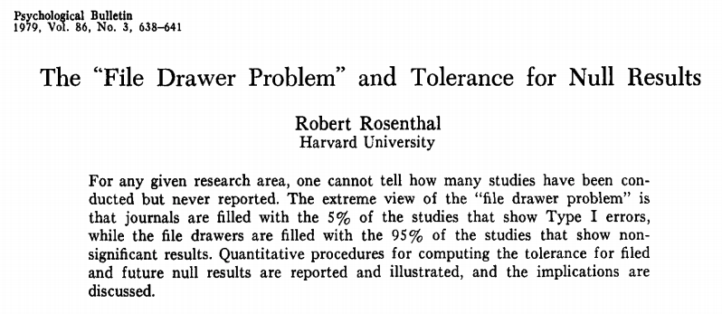
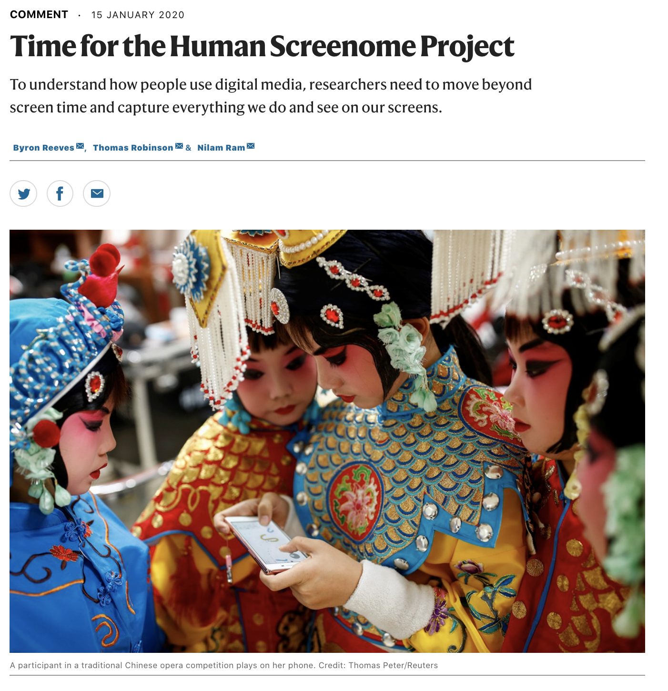
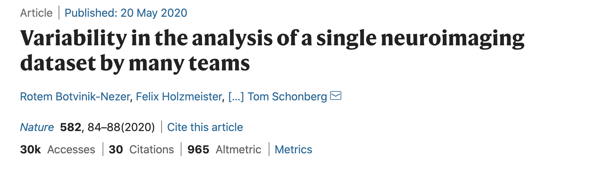

```{r setup, include=FALSE}
knitr::opts_chunk$set(echo = FALSE)
```

# Preliminaries

---

<div class="centered">
```{r, out.width="200px"}
# NSF
knitr::include_graphics("https://upload.wikimedia.org/wikipedia/commons/8/87/NSF_Logo.PNG")
# NICHD
knitr::include_graphics("https://res-3.cloudinary.com/crunchbase-production/image/upload/c_lpad,h_120,w_120,f_auto,b_white,q_auto:eco/ex89p5pm1bvck2ow3vwd")
# NIDA
knitr::include_graphics("https://www.drugabuse.gov/sites/default/files/images/web-NIH_NIDA_Vertical_Logo_2Color.jpg")
# NIMH
knitr::include_graphics("https://logodix.com/logo/1750528.jpg")
```

</br>

```{r, out.width="200px"}
# Sloan
knitr::include_graphics("https://sloan.org/storage/app/media/Logos/Sloan-Logo-stacked-black-web.png")
# SRCD
knitr::include_graphics("http://newsroom.unl.edu/announce/files/file77330.jpg")
# LEGO
knitr::include_graphics("https://www.unicef.org.hk/wp-content/uploads/2017/08/Logo-05_Lego-foundation_UNICEF_partnership.jpg")
```
</div>

---

<div class="centered">


</br>

</div>

<!-- Gilmore photo biography -->

## Agenda

- The reproducibility crisis in science 
- Databrary.org
- Questions to discuss

# The reproducibility crisis in science

---

<iframe width="560" height="315" src="https://www.youtube.com/embed/66oNv_DJuPc" frameborder="0" allow="accelerometer; autoplay; clipboard-write; encrypted-media; gyroscope; picture-in-picture" allowfullscreen></iframe>

## What proportion of findings in the published scientific literature (in the fields you care about) are *actually true*?

---

- 100%
- 90%
- 70%
- 50%
- 30%

## How do we define what "*actually true*" means?

## Is there a reproducibility crisis in science?

---

- Yes, a significant crisis
- Yes, a slight crisis
- No crisis
- Don't know

---

```{r, fig.cap="[[@Baker2016-rz]](http://doi.org/10.1038/533452a)", fig.align='center'}
knitr::include_graphics("http://www.nature.com/polopoly_fs/7.36716.1469695923!/image/reproducibility-graphic-online1.jpeg_gen/derivatives/landscape_630/reproducibility-graphic-online1.jpeg")
```

## Have you failed to reproduce an analysis from your lab or someone else's?

---

```{r, fig.cap="[[@Baker2016-rz]](http://doi.org/10.1038/533452a)", fig.align='center'}
knitr::include_graphics("http://www.nature.com/polopoly_fs/7.36718.1464174471!/image/reproducibility-graphic-online3.jpg_gen/derivatives/landscape_630/reproducibility-graphic-online3.jpg")
```

---

```{r, fig.cap="[[@Baker2016-rz]](http://doi.org/10.1038/533452a)", fig.align='center'}
knitr::include_graphics("http://www.nature.com/polopoly_fs/7.36719.1464174488!/image/reproducibility-graphic-online4.jpg_gen/derivatives/landscape_630/reproducibility-graphic-online4.jpg")
```

<!-- Factors contributing to irreproducible research -->

---

```{r, fig.align='center', fig.cap='[[@Munafo2017-dc]](http://doi.org/10.1038/s41562-016-0021)', out.width="800px"}
knitr::include_graphics("https://media.springernature.com/full/springer-static/image/art%3A10.1038%2Fs41562-016-0021/MediaObjects/41562_2016_Article_BFs415620160021_Fig1_HTML.jpg?as=webp")
```

<!-- Manifesto for reproducible science -->

## File drawer problem

```{r, out.width='900px', fig.align='center', fig.cap='[[@Rosenthal1979-zi]](https://doi.org/10.1037/0033-2909.86.3.638)'}

```

## Inference is underpowered


```{r, out.width="900px", fig.align='center', fig.cap="[[@Szucs2017-fc]](https://doi.org/10.1371/journal.pbio.2000797)"}
knitr::include_graphics("https://journals.plos.org/plosbiology/article/file?id=10.1371/journal.pbio.2000797.g003&type=large")
```

---

<div class="centered">
>*Assuming a realistic range of prior probabilities for null hypotheses, false report probability is likely to exceed 50% for the whole literature.*

[[@Szucs2017-fc]](https://doi.org/10.1371/journal.pbio.2000797)
</div>

---

```{r, out.width="600px", fig.align = 'center'}
knitr::include_graphics("https://media3.giphy.com/media/Tim0q7zolF3fa/giphy.webp?cid=ecf05e47yjvat0dd7qo18too3gfu6o2hf9kybv0bfl9oexd3&rid=giphy.webp")
```

<!-- It's a flesh wound gif -->

## Why should we care?

- Emphasizing transparency and openness in science...

> "*will yield more robust and reliable findings that others can readily build upon*" [[@Srcd2019-hg]](https://www.srcd.org/policy-scientific-integrity-transparency-and-openness)

- Open sharing of research data and materials...

> "*is essential for the conduct of research and its application to practice and policy*" [[@Srcd2019-hg]](https://www.srcd.org/policy-scientific-integrity-transparency-and-openness)

# Databrary.org

## Data about people requires protection

- Breaches of *privacy*
- Breaches of *confidentiality*
- How are data collected?
- How are data stored and shared?

## Video and audio data pose special risks

- Faces & voices
- Names, personal locations
- Behaviors

## Video has unique research potential

as **data**...

- Spatially & temporally dense samples of behavior
- "Outputs" of biological processes

[[@Adolph_KE_Gilmore_RO_Kennedy_JL2017-va]](https://www.apa.org/science/about/psa/2017/10/video-data)

## and as **documentation**...

- How procedures are [actually done](https://www.play-project.org/collection.html)
- Computer-based [task displays](https://nyu.databrary.org/volume/31)

[[@Gilmore2017-wd]](https://doi.org/10.1038/s41562-017-0128)

---

```{r, fig.align='center', out.width="500px", fig.cap="[[@Reeves2020-fh]](http://dx.doi.org/10.1038/d41586-020-00032-5)"}

```

## How to protect against risk & realize potential?

---

<iframe src="https://databrary.org" height=600px width=1000px>
</iframe>

---

```{r}
db_stats <- databraryapi::get_db_stats()
```

- World's only data library specialized for storing and sharing video and audio
- Hosted at New York University
- Opened 2014
- `r db_stats$institutions` institutions; `r db_stats$investigators + db_stats$affiliates` researchers; `r format(db_stats$hours, digits = 5, decimal.mark=".", big.mark=",", small.mark=".", small.interval=2)` hours of video + other data; `r db_stats$datasets_shared` shared projects

## How Databrary protects personal data

- Data shared only with participant permission (& IRB approval)
- [Template language](https://www.databrary.org/resources/templates/release-template.html), scripts and [procedure documentation](https://www.databrary.org/video/example-video-1.mp4)

## Open sharing (but with restricted audiences)

- Researchers require institutional authorization
- [Formal access agreement](https://www.databrary.org/resources/agreement.html)
- Site-wide access, not dataset-specific
- Data use and contribution

## Virtues

- Restricted data sharing has long track-record
- Meaningful sharing permission; clarifies nature of risk
- Empowers participants
- Researchers & institutions determine what to share & when

---

- Open, but not public, sharing
- Researchers, Institutions need not reinvent wheels
- More discoverable than personal websites or institutional repositories
- More secure than public data and materials services or journal web pages

---

- Consistent curation makes reuse easier
- Works for data beyond video
- Secure data interaction via API

---

```{r, echo=TRUE}
databraryapi::get_db_stats()
```

<https://github.com/PLAY-behaviorome/databraryapi>

# Whither open science

## Databrary 2.0

- Updated policy framework
- Rewriting in Node.js, Hasura/GraphQL, Vue.js/Quasar
- [Results from recent community survey](https://docs.google.com/forms/d/1rgQ-eBXEopn_EU2CYHv9P5ao_R2PIFCqKT3nwiIHiFM/edit#responses)
    - Make uploading & curation easier
    - Hooks to make AI/ML easier

## Why is data sharing valuable?

>*transparency and openness in science*

>*efficient use of effort and tax money*

>*it's fundamental to science*

>*draw on a broader, more representative sample.*

>*Ethical: Why recollect data when it's not needed.*

## Why do you think more researchers don't share their data?

>*Hard to do*

>*People are incentivized to collect new data*

>*IRB restrictions*

>*It's hard and invites criticism*

>*Fear of being scooped*

## One dataset, many analysts

```{r, out.width="800px", fig.align = 'center', fig.cap="[[@Silberzahn2018-st]](https://doi.org/10.1177/2515245917747646)"}
knitr::include_graphics("https://journals.sagepub.com/na101/home/literatum/publisher/sage/journals/content/ampa/2018/ampa_1_3/2515245917747646/20181024/images/large/10.1177_2515245917747646-fig2.jpeg")
```

---

```{r, fig.align = 'center', fig.cap="[[@Botvinik-Nezer2020]](https://doi.org/10.1177/2515245917747646)"}

```

---

<div class="centered">
>*...no two teams chose identical workfows to analyse the data. This flexibility resulted in sizeable variation in the results of hypothesis tests...*

>*Our findings show that analytical flexibility can have substantial effects on scientific conclusions... The results emphasize the importance of validating and sharing complex analysis workflows, and demonstrate the need for performing and reporting multiple analyses of the same data.*

[[@Botvinik-Nezer2020]](https://doi.org/10.1038/s41586-020-2314-9)
</div>

# Discussion

## Where do researchers in your field share your data, materials, and analysis workflows?

## If sharing data and materials is not commonplace, why?

## What barriers must be overcome to make it commonplace?

## Can sharing data in repositories make reproducible workflows easier?

## Who owns data? Who should?

## Does de-identification offer sufficient protection to participants?

## Shouldn't most (all?) human data be shared via restricted means to protect participants?

---

<div class="centered">
<video width="800" loop data-autoplay>
  <source src="https://github.com/gilmore-lab/DEVSEC-2018/blob/master/mov/databrary-splash.mp4?raw=true" type="video/mp4">
  </video>
rog1\@psu.edu</br>
<https://gilmore-lab.github.io></br>
<https://github.com/gilmore-lab/2020-11-19-soda-502>
</div>

# Resources

## Software

<!-- Scrolling slides -->
<!-- http://stackoverflow.com/q/38260799 -->
<style>
slides > slide { overflow: scroll; }
slides > slide:not(.nobackground):before {
  background: none;
  }
slides > slide:not(.nobackground):after {
  content: '';
  background: none;
  }
}
</style>

This talk was produced on `r Sys.Date()` in [RStudio](http://rstudio.com) using R Markdown.
The code and materials used to generate the slides may be found at <https://github.com/gilmore-lab/2020-11-19-soda-502>.
Information about the R Session that produced the code is as follows:
```{r session-info}
sessionInfo()
```

## References {.smaller}